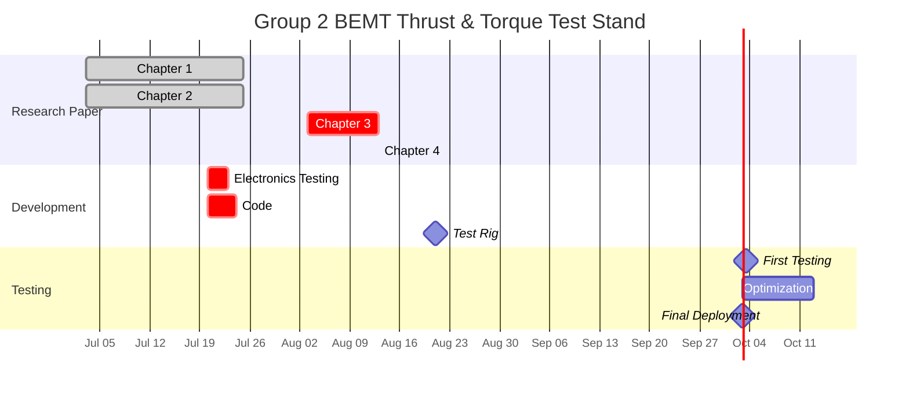

```mermaid
gantt
    title Group 2 BEMT Thrust & Torque Test Stand
    dateFormat  YYYY-MM-DD
    axisFormat  %b %d

    section Research Paper
    Chapter 1            :done,   des1, 2026-07-03, 2026-07-25
    Chapter 2            :done,   des2, 2026-07-03, 2026-07-25
    Chapter 3            :crit,   des3, 2026-08-03, 10d
    Chapter 4            :active, des4

    section Development
    Electronics Testing  :crit,       dev, 2026-07-20, 3d
    Code                 :crit,       dev, 2026-07-20, 4d
    Test Rig             :milestone,  dev3, after des3, 16d

    section Testing
    First Testing        :milestone, dev,  after dev2, 1d
    Optimization         :  dev, after dev1, 10d
    Final Deployment     :milestone, dev, after 1, 0d
```
