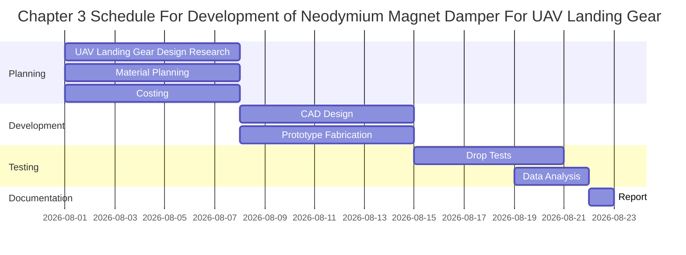

```mermaid
gantt
    title Chapter 3 Schedule For Development of Neodymium Magnet Damper For UAV Landing Gear
    dateFormat MM-DD

    section Planning
    UAV Landing Gear Design Research     :a1, 08-01, 7d
    Material Planning                    :a1, 08-01, 7d
    Costing                              :a1, 08-01, 7d

    section Development
    CAD Design                           :b1, 08-08, 7d
    Prototype Fabrication                :b2, 08-08, 7d

    section Testing
    Drop Tests                           :c1, 08-15, 6d
    Data Analysis                        :c2, 08-19, 3d

    section Documentation
    Report                               :d1, 08-22, 1d
```
