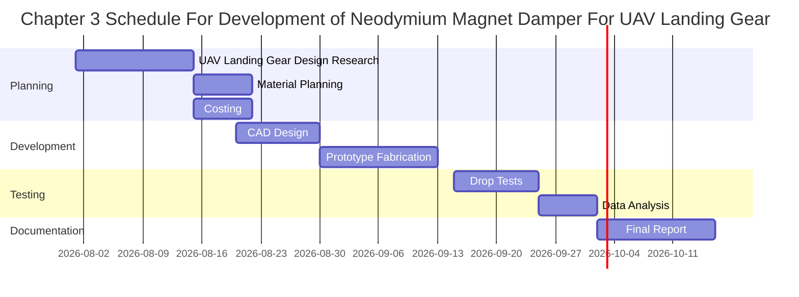

```mermaid
gantt
    title Chapter 3 Schedule For Development of Neodymium Magnet Damper For UAV Landing Gear
    dateFormat  YYYY-MM-DD

    section Planning
    UAV Landing Gear Design Research     :a1, 2026-08-01, 14d
    Material Planning                    :a2, after a1, 7d
    Costing                              :a2, after a1, 7d

    section Development
    CAD Design                           :b1, 2026-08-20, 10d
    Prototype Fabrication                :b2, after b1, 14d

    section Testing
    Drop Tests                           :c1, 2026-09-15, 10d
    Data Analysis                        :c2, after c1, 7d

    section Documentation
    Final Report                         :d1, after c2, 14d
```
